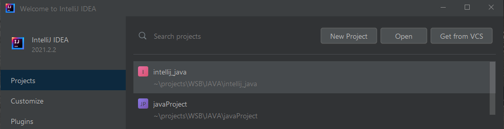

# Wrzucenie projektu IntelliJ do repozytorium GIT

W tym pliku znajdziesz informację jak utworzyć nowy projekt Java w IntelliJ oraz wrzucić go na repozytorium zdalnego GitHub.

## Stworzenie nowego projektu Java

Po uruchomieniu IntelliJ wybieramy opcję `Create New Project':

Wybieramy odpowiednią wersję SDK:

Wybieramy opcję `Create project from template`:

Podajemy nazwę projektu:

Po stworzeniu będzie projekt Java z już utworzoną klasą `Main`:

Zatem został założony nowy projekt Java w IntelliJ.

Żeby wrzucić projekt Java znajdujący się w IntelliJ do na GitHub wystarczy, że skorzystamy z menu IntelliJ. W górnym menu wybieramy `VCS` --> `Import into Version Control` --> `Share Project on GitHub...`. Po kliknięciu pojawi się okno, w którym od razu będziemy mieli nazwę repozytorium, wskazaną domyślną nazwę repozytorium zdalnego jako origin oraz pole do wpisania opisu dla repozytorium:

Po kliknięciu `Share` mamy okno z możliwością dodania pierwszego commit. Wybieramy tylko plik Main.java:

Po zaakceptowaniu mamy od razu nasz projekt na GitHub:

