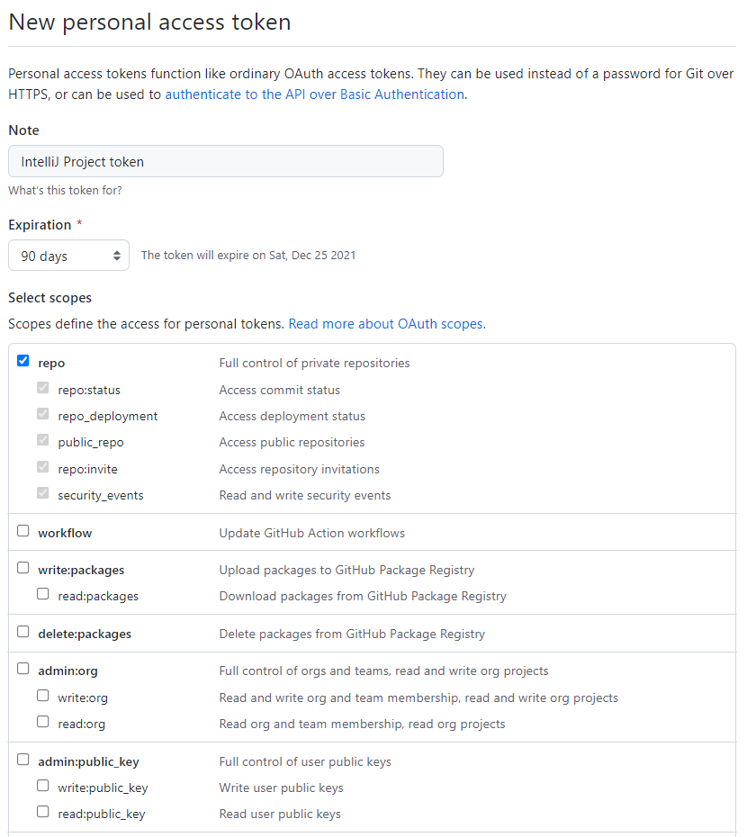
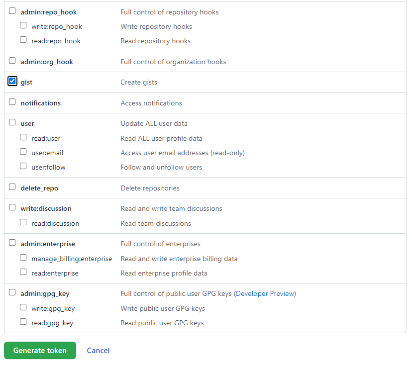
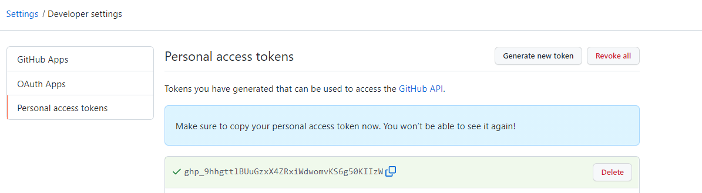
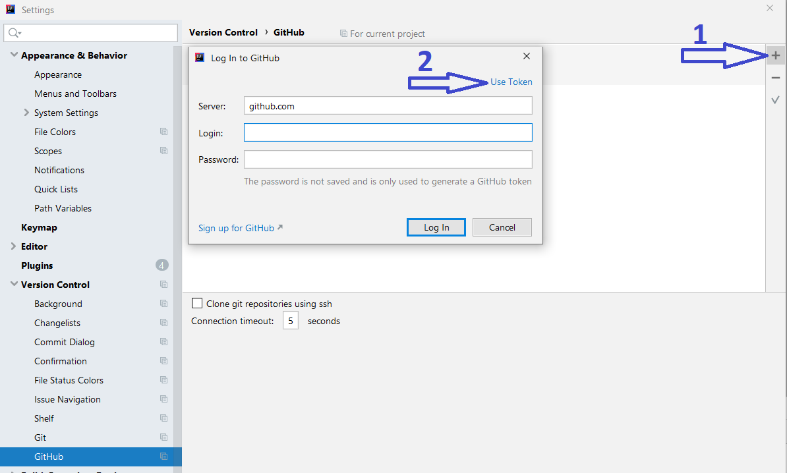
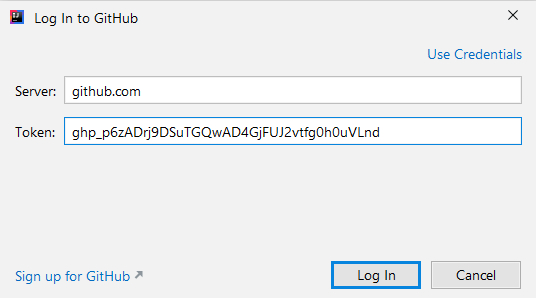
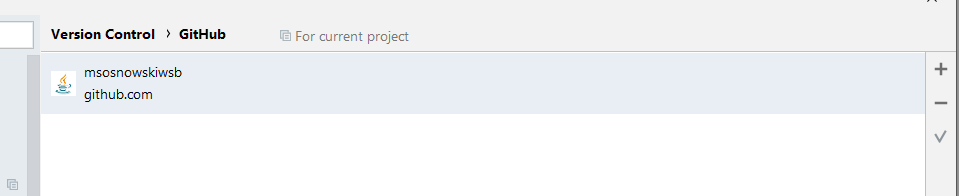

# Autoryzacja za pomocą tokenu IntelliJ - GitHub

Żeby wygenerować token w GitHub należy po kliknięciu na ikonę swojego konta wybrać opcję `Settings`. Następnie przejść do sekcji `Developer Settings`, a następnie `Personal access tokens`. W tym miejscu należy kliknąć `Generate new token`.

W formularzu należy podać opis i wybrać 2 wartości: `repo` oraz `gist`:

Po potwierdzeniu widać wygenerowany token (zielone pole):

Token po wygenerowaniu trzeba skopiować, bo po przejściu na inną stronę już nie będzie widoczny.

Jeżeli mamy wygenerowany token należy w `IntelliJ` z górnego menu wybrać: `File` --> `Settings` --> `Version Control` --> `GitHub`.

Należy kliknąć znak `+` oraz `Use token`:

W widocznym oknie należy wprowadzić wygenerowany wcześniej token:

Po dodaniu powinien być widoczny wpis:

