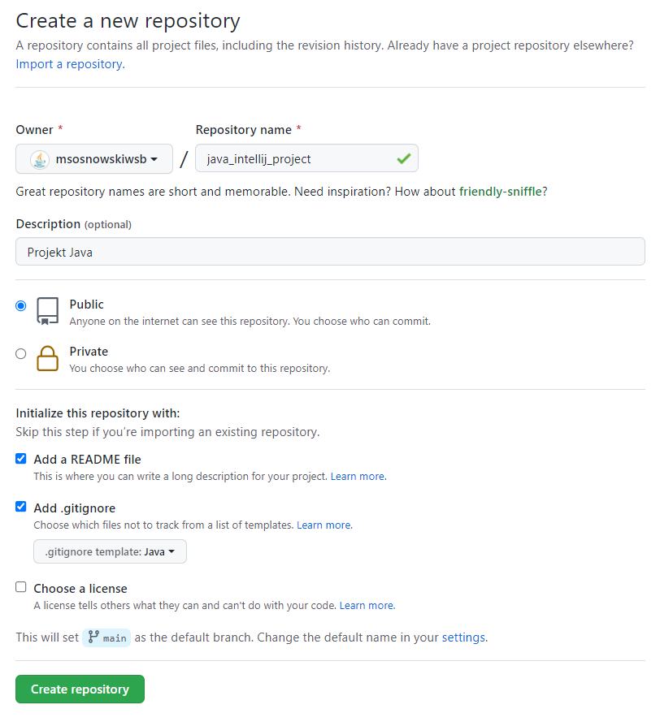
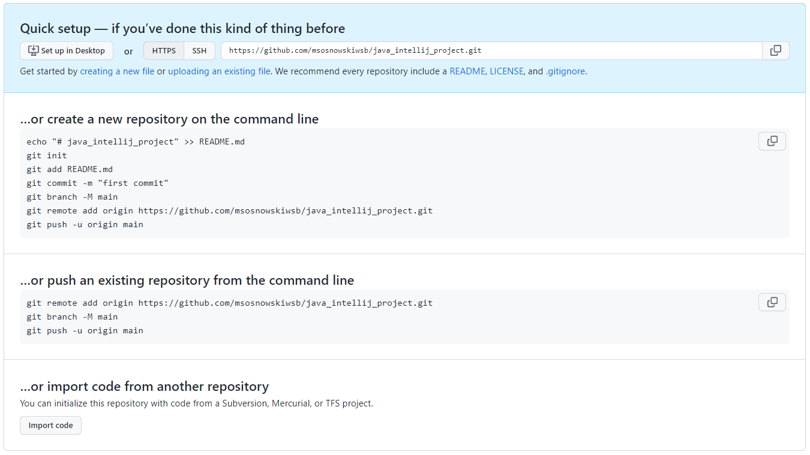

# Stworzenie repozytorium zdalnego na GitHub, sklonowanie oraz autoryzacja

Po zalogowaniu się na konto GitHub należy przejść do formularza tworzenia nowego repozytorium i uzupełnić pola:

- `Repository_name` - wpisujemy nazwę repozytorium
- `Description` - podajemy krótki opis repozytorium
- `Public`/`Private` - wybieramy czy repozytorium ma być publiczne czy prywatne
- `Add a README file` - opcjonalnie można dodać plik, w którym będzie można opisywać projekt
- `Add .gitignore` - opcjonalnie można od razu utworzyć plik wyłączeń

Poniżej screen formularza:

Po utworzeniu repozytorium otrzymamy link do niego oraz informacje pomocnicze jak można stworzyć nowe repozytorium i je umieścić na GitHub oraz jak umieścić na GitHub repozytorium, które już istnieje:

Należy skopiować adres https. Dla powyższego przykładu jest to: <https://github.com/msosnowskiwsb/java_intellij_project.git>.

TODO: klonujemy

TODO: autoryzujemy